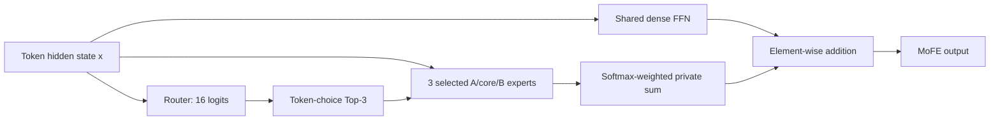

# MoFE：GPT-2 Shared Expert + Factorized Experts 技术实现与实验任务书

## 1. 目标与范围

基于 dense GPT-2 small（`openai-community/gpt2`，124M）实现 MoFE（Mixture of Factorized Experts）。仅将最后 3 个 Transformer block 的 FFN 替换为 MoFE；GPT-2 small 共 12 层，按 0 开始编号时修改第 `9、10、11` 层。

每个 MoFE 层包括：

- 1 个始终激活的 shared expert；
- 16 个由 A/core/B 生成的 private expert；
- token-choice router，每个 token 从 16 个 private expert 中选择 top-3；
- shared expert 不参与路由，始终处理全部 token；
- 输出为 shared expert 与 top-3 private expert 加权输出之和。

任务包括代码实现、初始化验证、训练、评测、路由分析和结果作图。模型权重、数据集、checkpoint、日志和结果统一放到当前实验根目录的 `./data/pxchen`。代码仓库放在服务器上便于管理的位置即可，不强制固定路径，但必须记录绝对路径和 Git commit。

## 2. 主实验配置

| 项目 | 配置 |
| --- | --- |
| Dense checkpoint | `openai-community/gpt2` |
| 模型 | GPT-2 small，124M，12 层，hidden size 768 |
| FFN | 两层 GELU MLP，不使用 SwiGLU |
| MoFE 层 | block `9、10、11` |
| Shared expert | 每层 1 个，完整复制对应 dense FFN |
| Private experts | 每层 16 个 |
| Router | Token-choice |
| Top-k | 3 |
| Shared 路径 | 始终激活，不进入 top-k |
| Low-rank ratio | `0.75` |
| Rank | `r = int(0.75 × 768) = 576` |
| A/B/core | 全部可训练 |
| Shared expert | 主实验默认可训练，另做冻结消融 |
| Private bias | 零初始化，可训练 |
| 训练精度 | bf16 |
| 分布式 | 4 卡 DDP，暂不要求 expert parallel |

配置变化必须写入运行配置和日志，不能只修改代码默认值。

## 3. 数学定义

### 3.1 Dense FFN 与 shared expert

GPT-2 small 中 `d=768`、FFN 中间维度 `f=3072`。按 `nn.Linear` 权重方向，dense FFN 为：

```text
h = GELU_new(W1 x + b1)
y_dense = W2 h + b2

W1: [3072, 768]    b1: [3072]
W2: [768, 3072]    b2: [768]
```

每个 MoFE 层的 shared expert 完整复制原 dense FFN 的 `W1、b1、W2、b2`，并保持原激活函数和 dropout 行为：

```text
y_shared(x) = FFN_dense_copy(x)
```

推荐直接 `deepcopy` 原始 GPT-2 MLP，或复用原 MLP 作为 shared 分支，不要手写一个行为不同的 MLP 后只复制权重。

### 3.2 16 个 factorized private experts

参考 `ds_exmidlora_moe.py`，16 个 private expert 不是 16 套独立 A/B。使用 4 组 A 与 4 组 B 交叉组合，每个 expert 具有独立 core：

```text
e = 4i + j,  i,j ∈ {0,1,2,3}
W1_e = A1_i C1_e B1_j
W2_e = A2_i C2_e B2_j
```

形状为：

```text
A1: [4, 3072, 576]      B1: [4, 576, 768]
C1: [16, 576, 576]

A2: [4, 768, 576]       B2: [4, 576, 3072]
C2: [16, 576, 576]

db1: [16, 3072]         db2: [16, 768]
```

第 `e` 个 private expert：

```text
i = e // 4
j = e % 4
h_e = GELU_new((A1_i C1_e B1_j)x + db1_e)
y_e = (A2_i C2_e B2_j)h_e + db2_e
```

private expert 的权重就是 `A C B`，不额外加 dense 权重。dense 能力由单独的 shared expert 保留。不要实现成 `W_dense + A C B`。

`A1、B1、C1、A2、B2、C2、db1、db2` 全部加入 optimizer。

### 3.3 Token-choice top-3 路由

router 只对 16 个 private expert 打分：

```text
z = W_router x + b_router, z ∈ R^16
I(x) = TopK(z, k=3)
g_e(x) = Softmax(z_e, e ∈ I(x))
```

每个 token 必须恰好选择 3 个 private expert。主实验不设置 capacity 截断、不丢 token。shared expert 不在 top-3 内，也不参加 softmax。

最终输出：

```text
y_MoFE(x) = y_shared(x) + Σ[e ∈ I(x)] g_e(x)y_e(x)
Σ[e ∈ I(x)] g_e(x) = 1
```

不要用 router 权重缩放 shared 输出。

整体数据流如下：



## 4. 初始化方案

### 4.1 Shared expert

对 `l ∈ {9,10,11}`：

```text
shared_l ← 完整复制 dense_model.transformer.h[l].mlp
```

逐 tensor 验证 `max_abs_diff == 0`。关闭 dropout 后，同一输入经过原 dense MLP 和 shared expert，输出最大误差应小于 `1e-6`（fp32）或 `1e-3`（bf16）。

### 4.2 GPT-2 权重转置

Hugging Face GPT-2 使用 `Conv1D`，其权重存储方向与 `nn.Linear.weight` 相反。初始化 A/B 前必须转换：

```python
W1 = dense_mlp.c_fc.weight.T       # [3072, 768]
W2 = dense_mlp.c_proj.weight.T     # [768, 3072]
```

漏掉转置会导致形状或数学含义错误。

### 4.3 A/B 的切片初始化

按截图和参考文件，对 `i=0,1,2,3`：

```text
A1_i ← W1[:, :r]       # [3072, 576]
B1_i ← W1[:r, :]       # [576, 768]
A2_i ← W2[:, :r]       # [768, 576]
B2_i ← W2[:r, :]       # [576, 3072]
```

四组 A/B 初始内容相同，16 个 expert 的初始差异主要来自独立随机 core。主实验不对 A/B 额外加随机噪声。

参考代码称其为“Nyström init”，但这里实际是直接行列切片，不包含经典 Nyström 公式中的中心子矩阵求逆或伪逆。报告中应准确描述为“Nyström-style row/column slice initialization”。

### 4.4 Core 与 bias

每层、每个 expert 的输入侧 core 独立随机初始化，输出侧 core 使用保持原函数的零初始化：

```text
C1_e ~ Normal(0, σ²)
C2_e = 0
σ = 0.1 × 192 / 768 = 0.025
```

实现：

```python
torch.nn.init.normal_(core1, mean=0.0, std=0.025)
torch.nn.init.zeros_(core2)
torch.nn.init.zeros_(private_bias)
```

不同层、不同 expert 的 `C1` 必须不同；`C2` 从零开始但保持可训练。这样完整
MoFE 在初始化时严格等于 shared/dense 模型，`C2` 更新后其余 private 参数逐步
获得语言模型梯度。A/B、core 和 private bias 均可训练。

### 4.5 Router 与随机种子

router 建议：

```text
W_router ~ Normal(0, 0.02²)
b_router = 0
```

不要将 router 权重全部置零，否则完全相同 logits 下的 `topk` 可能持续偏向固定 expert 编号。

主实验固定 `seed=42`，同时设置 Python、NumPy、PyTorch CPU/CUDA 和 DataLoader seed。正式主要结果建议补 3 个 seed，工程验证先运行 seed 42。

## 5. GPT-2 适配要求

### 5.1 替换范围

只替换：

```text
model.transformer.h[9].mlp
model.transformer.h[10].mlp
model.transformer.h[11].mlp
```

第 0-8 层、attention、LayerNorm、embedding、LM head 均保持不变，embedding 与 LM head 的权重绑定必须保留。

### 5.2 输入输出

Hugging Face GPT-2 MLP 输入通常为 `[batch, sequence, hidden]`。MoFE 内部可展平为 `[tokens, hidden]`，返回前必须恢复原 shape、dtype 和 device。不要沿用只适配 `[sequence, batch, hidden]` 的假设。

### 5.3 激活和 dropout

保持 GPT-2 的激活与 dropout 位置。参考文件的 `_Activate` 已含 dropout，token-choice 路径随后又调用一次 dropout，存在重复 dropout 的风险。GPT-2 版本不能原样复制该逻辑；每个 expert 的 dropout 次数和位置必须与原 GPT-2 MLP 对齐。

### 5.4 高效计算

正确性版本可先物化：

```text
W_e = A_i C_e B_j
```

验证后建议按因子顺序计算：

```text
x B_j^T → 乘 C_e^T → 乘 A_i^T
```

两种实现需在 fp32 下通过数值一致性测试。不要在每个 token 循环中重复生成完整 expert 权重；应按层、forward 或被激活 expert 批量处理。

## 6. 训练损失与路由稳定性

总损失：

```text
L = L_LM + λ_balance L_balance + λ_z L_z
λ_balance = 0.01
λ_z = 0.001
```

`L_LM` 为标准 causal LM cross-entropy。每层分别计算负载均衡损失：

```text
p_e = batch 内 router 对 expert e 的平均完整 softmax 概率
f_e = expert e 的 top-k assignment 数 / (token 数 × 3)
L_balance = 16 × Σ_e p_e f_e
```

`L_z` 为 router `logsumexp` 的平方均值。日志中必须分别记录 `L_LM、L_balance、L_z`。若复用 D2DMoE 的辅助损失，必须确认它适用于 token-choice top-k，而不是 expert-choice。

每个 MoFE 层需记录 16 个 expert 的分配次数和比例、最大/最小负载比、负载变异系数、router entropy、未激活 expert 数。DDP 下先跨 rank 汇总再写日志。

## 7. 参数量与可行性预估

在 `r=576`、4 组 A、4 组 B、16 个 core 下，每个 MoFE 层约为：

| 部分 | 参数量 |
| --- | ---: |
| Shared dense FFN | 4,722,432 |
| 两层 A/B banks | 17,694,720 |
| 两层 16 个 core | 10,616,832 |
| Private bias | 61,440 |
| Router | 12,304 |
| 每层合计 | 约 33.11M |

替换最后 3 层后，总参数预计由约 124.44M 增加到约 209.6M。实现后必须用代码打印精确值，并分别统计 shared、A/B、core、router 和其余 backbone。

每个 token 在 MoFE 层执行 1 个 shared FFN 和 3 个 private FFN，因此末三层 FFN 计算约为 dense 的 4 倍，但全模型不是 4 倍。该规模可在 4 张 4090 上用 bf16 和 DDP 训练。建议开启 gradient checkpointing，并用 gradient accumulation 控制有效 batch size。

## 8. 配置接口

至少提供以下 YAML 或等价命令行参数：

```yaml
model_name_or_path: openai-community/gpt2
moe_type: mofe
moe_layer_indices: [9, 10, 11]
num_private_experts: 16
top_k: 3
routing: token_choice
shared_expert: true
shared_expert_in_router: false
low_rank_ratio: 0.75
rank: 576
factor_sharing: cartesian_4x4
factor_init: dense_row_column_slice
core_init: normal_input_zero_output
core_init_std: 0.025
zero_init_output_core: true
private_bias_init: zeros
train_factors: true
train_cores: true
train_private_bias: true
train_router: true
train_shared_expert: true
router_aux_loss_coef: 0.01
router_z_loss_coef: 0.001
precision: bf16
seed: 42
```

checkpoint 必须包含 MoFE 配置，加载时不能依赖代码中的隐式默认值。

## 9. 数据与代码目录

所有大文件固定放在当前实验根目录的：

```text
./data/pxchen/
```

建议结构：

```text
./data/pxchen/
├── hf/
├── datasets/
├── checkpoints/mofe_gpt2_last3_e16_k3/
├── runs/mofe_gpt2_last3_e16_k3/
└── results/mofe_gpt2_last3_e16_k3/
    ├── metrics/
    ├── routing/
    └── figures/
```

```bash
export PROJECT_ROOT="$(pwd)"
export DATA_ROOT="$PROJECT_ROOT/data/pxchen"
export HF_HOME="$DATA_ROOT/hf"
export HF_DATASETS_CACHE="$DATA_ROOT/datasets"
export TOKENIZERS_PARALLELISM=false
```

代码仓库位置不强制。每次运行的 `environment.txt` 中必须记录仓库绝对路径、remote URL、Git commit、`git status --short`、Python/PyTorch/CUDA/GPU 和依赖版本。

## 10. 分阶段实施与验收

### 阶段 A：Dense 基线

加载 GPT-2 small，完成固定 prompt 推理、WikiText-2 validation perplexity，以及 `lambada_openai、hellaswag、piqa、winogrande、arc_easy、arc_challenge` 的零样本评测。保存原始 JSON、汇总 CSV 和图。

### 阶段 B：MoFE 初始化验证

训练前必须通过：

1. 只有 block 9、10、11 被替换。
2. 每层有 1 个 shared 和 16 个 private expert。
3. 每个 token 恰好选择 3 个 private expert。
4. shared 参数与原 dense FFN 完全相同。
5. A/B 与对应 dense 权重切片完全一致。
6. 16 个 `C1` 形状正确、非零且彼此不同，`C2` 为零且可训练。
7. A/B/core/private bias/router 均有非空梯度。
8. 关闭 private 分支后，模型 logits 与原 dense 模型对齐。
9. 开启 private 分支后输出无 NaN/Inf。
10. 保存并重新加载 checkpoint 后，相同输入 logits 一致。

生成 `initialization_report.json`，至少包含每层参数的 shape、mean、std、norm、`requires_grad` 和与 dense 参数的最大差值。

### 阶段 C：短程训练

先做单 batch 过拟合，再训练 100-500 step，确认 LM loss 下降，显存和吞吐正常，A/B/core/router 均更新，expert 没有明显塌缩，DDP 不报告未使用参数错误。

### 阶段 D：正式训练与评测

与 dense 基线保持相同 tokenizer、数据预处理、sequence length、有效 batch size 和评测协议。保存 best validation loss、last checkpoint、optimizer/scheduler、完整配置、路由统计和原始评测结果。

## 11. 对比实验

最低三组：

| 实验 | 结构 | 目的 |
| --- | --- | --- |
| Dense | GPT-2 small，相同预算 continued training | 基础对照 |
| Dense upcycling MoE | 最后三层，16 个复制 dense FFN 的 private expert，top-3 | 标准 upcycling 对照 |
| MoFE | 最后三层，shared dense + 16 个 A/core/B expert，top-3 | 我们的方法 |

三组使用相同训练 token 数、数据顺序、sequence length、有效 batch size、评测脚本和 checkpoint 选择规则。建议消融：冻结 shared、去掉 shared、top-1/top-2、只训练 core、不同 expert 数和不同 rank。

## 12. 评测与作图

需要报告：validation loss、WikiText-2 perplexity、六项下游分数、总/可训练参数量、tokens/s、step 时间、峰值显存、GPU-hours、推理吞吐，以及三层 router 的负载和 entropy。

图必须从 JSON/CSV 自动读取数据，不可手工录入。使用英文标题、坐标轴和图例，保存作图脚本。至少生成：

1. `mofe_architecture.png`：shared 路径与 token-choice top-3 private 路径的整体结构图。
2. `factorized_expert.png`：4 组 A、4 组 B、16 个独立 core 交叉生成 16 个 expert 的初始化和组合图。
3. `training_loss.png`：三组 LM loss 对训练 token 数。
4. `validation_perplexity.png`：三组 perplexity。
5. `downstream_scores.png`：六项下游任务分组柱状图。
6. `expert_usage_layer9.png`、`expert_usage_layer10.png`、`expert_usage_layer11.png`。
7. `router_entropy.png`。
8. `throughput_memory.png`。
9. `expert_similarity_heatmap.png`：private expert 有效 W1/W2 的 cosine similarity。

保存到：

```text
./data/pxchen/results/mofe_gpt2_last3_e16_k3/figures/
```

## 13. 易错点

1. GPT-2 small 是 124M，不是 1.24B。
2. 不下载 HF 仓库的 TF、Flax、ONNX 权重。
3. 初始化前正确转置 GPT-2 `Conv1D.weight`。
4. shared expert 不进入 top-3，也不由 router 缩放。
5. private expert 是独立 `ACB` 分支，不是 `W_dense + ACB`。
6. 实现 token-choice，而非 expert-choice。
7. private expert 中不要重复 dropout。
8. 使用 4×4 交叉共享 A/B，不是 16 套完整 A/B。
9. 保存 checkpoint 时保留 MoFE 配置、router 和训练状态。
10. 同时报告语言模型、下游、路由和效率指标。

## 14. 最终交付物

- 可加载的 MoFE 模型代码及配置；
- 初始化和前向单元测试；
- dense、upcycling MoE、MoFE 三组配置；
- 训练和评测脚本；
- best/last checkpoint；
- 环境、Git commit 和完整命令；
- 原始 JSON/CSV、路由统计和全部图；
- 结果汇总 Markdown，逐项说明验收是否通过及异常情况。

## 15. 参考资料

- 本地参考实现：`ds_exmidlora_moe.py`
- 用户提供截图：A/B 从 dense FFN 权重行列切片初始化
- D2DMoE 论文：<https://arxiv.org/abs/2405.15719>
- D2DMoE 代码：<https://github.com/bartwojcik/D2DMoE>
- GPT-2 small：<https://huggingface.co/openai-community/gpt2>
- Sparse Upcycling：<https://arxiv.org/abs/2212.05055>
