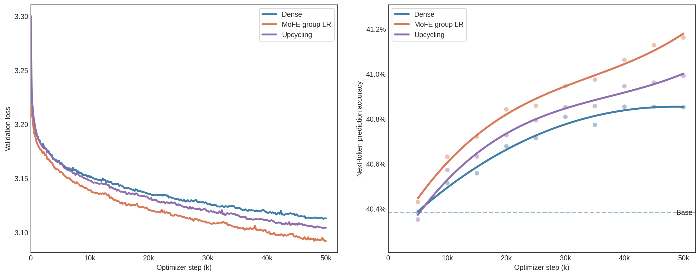
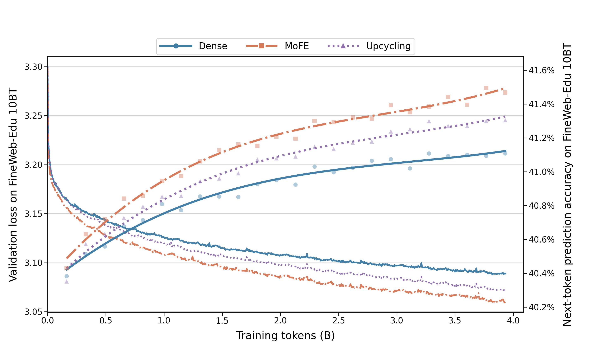

<div align="center">

# MoFEbaseD2D

**GPT-2 Small · FineWeb-Edu 10BT · Factorized Experts**

[中文](README.zh.md)

`Dense` &nbsp; `MoFE group LR` &nbsp; `Upcycling` &nbsp; `50k final + 120k diagnostic`

</div>

## Overview

MoFEbaseD2D studies sparse parameter expansion of GPT-2 Small on FineWeb-Edu
10BT. It compares three methods under the same training-token budget:

- **Dense**: continued pretraining of GPT-2 Small.
- **MoFE**: Mixture of Factorized Experts in the final three GPT-2 MLP blocks.
- **Upcycling**: sparse expansion using complete copies of the final three MLPs.

Unless explicitly labeled otherwise, **MoFE means MoFE group LR**. The older
single-learning-rate MoFE is preserved only as historical context in
[timeline.md](timeline.md) and is excluded from the final comparison.

## Method

MoFE replaces the MLPs in Transformer blocks 9, 10, and 11. Each converted layer
keeps one always-active dense shared expert and adds 16 factorized private
experts. A token-choice router selects the top 3 private experts per token.

With a `4 x 4` Cartesian factor-bank construction and expert `e = 4i + j`:

```text
W1_e = A1_i C1_e B1_j
W2_e = A2_i C2_e B2_j
```

The factorized path runs as `x -> B -> C -> A` without materializing complete
expert matrices per token. The shared branch is copied from the original GPT-2
MLP. Private output cores and biases are zero-initialized, so the converted model
preserves the Dense GPT-2 function at initialization.

## Final Protocol

| Setting | Value |
| --- | --- |
| Data | FineWeb-Edu 10BT, training shards 000-012 |
| Held-out set | Fixed validation tail from shard 013 |
| Hardware | 4 x RTX 4090 |
| Sequence length | 1024 |
| Global batch size | 32 sequences |
| Tokens per step | 32,768 |
| Optimizer steps | 50,000 |
| Training tokens per model | 1.6384B |
| Compute | BF16 |
| Master parameters / AdamW states | FP32 |
| Scheduler | Constant, no warmup |
| Validation | Every 200 steps |
| Checkpoint | Every 5,000 steps, including optimizer/scheduler/RNG state |

MoFE group LR uses `1e-5` for the backbone/shared experts, `2e-5` for private
experts, and `3e-5` for routers. Dense and Upcycling use `1e-5`.

Continuation checkpoints did not store the streaming dataloader cursor. A new
process restored model and optimizer state but rebuilt the fixed-seed stream
from its beginning. Token counts across continuation boundaries therefore mean
processed tokens, not unique tokens. Interpret both the 50k result and the 120k
extension below with this limitation.

## Results at 50k



FineWeb-Edu held-out results:

| Method | Validation loss | PPL | Next-token prediction accuracy |
| --- | ---: | ---: | ---: |
| Dense | 3.112968 | 22.4877 | 40.8511% |
| **MoFE group LR** | **3.092061** | **22.0224** | **41.1613%** |
| Upcycling | 3.104230 | 22.2921 | 40.9910% |

Downstream results use the original `acc` metric for both tasks:

| Method | LAMBADA acc | HellaSwag acc |
| --- | ---: | ---: |
| Dense | 0.340772 | 0.291675 |
| **MoFE group LR** | **0.343101** | **0.294662** |
| Upcycling | 0.340190 | 0.293467 |

ARC and WikiText are excluded from the final benchmark. HellaSwag `acc_norm` is
present in raw lm-eval JSON but is not used in the primary table.

## Diagnostic Extension to 120k



Step 120k corresponds to 3.93216B processed tokens. The 50k-to-80k and
80k-to-120k continuations restarted the training stream and therefore overlap
in examples; MoFE restarted it once more at 95k. These checkpoints support
diagnostic and method comparisons, not an uninterrupted unique-token scaling
claim.

| Method | Validation loss | Token accuracy | LAMBADA acc | HellaSwag acc |
| --- | ---: | ---: | ---: | ---: |
| Dense | 3.088866 | 41.1081% | 0.336115 | 0.292272 |
| **MoFE group LR** | **3.059887** | **41.4678%** | 0.339220 | **0.295758** |
| Upcycling | 3.072386 | 41.3044% | **0.339802** | 0.294563 |

## Raw Experiment Data

The 50k archive is in [results/final_50k](results/final_50k/README.md):

- `validation/validation_loss_50k.csv`: 50k held-out loss data for all three methods.
- `validation_prediction_accuracy/raw/`: 30 original JSON points, 10 checkpoints per method.
- `downstream/`: original 50k LAMBADA/HellaSwag JSON outputs for all three methods.
- `figures/`: the final side-by-side loss and token-accuracy figure.

The 80k-to-120k diagnostic archive is in
[results/final_120k](results/final_120k/README.md):

- `validation/`: complete held-out loss records through 120k.
- `validation_prediction_accuracy/`: 72 raw evaluations and the 5k-to-120k CSV.
- `downstream/`: consolidated and raw LAMBADA/HellaSwag results at 80k, 100k,
  110k, and 120k.
- `figures/`: the combined 120k loss and token-accuracy plot.

All historical experiments remain available in [archive](archive/README.md).

## Code and Usage

The active implementation lives in `MoFE/`. Install dependencies and run tests:

```bash
python -m venv .venv
source .venv/bin/activate
pip install -r requirements.txt

python -m unittest \
  MoFE.tests.test_data \
  MoFE.tests.test_mofe \
  MoFE.tests.test_upcycling
```

The full experiment record is maintained in [timeline.md](timeline.md).

## Upstream

This project is an independent derivative of
[D2DMoE](https://github.com/bartwojcik/D2DMoE), based on upstream commit
`a7027cdc1f01c9c618c39eebe639d1664549b066`. The upstream project and this
derivative use the MIT License. The associated paper is:

> Filip Szatkowski, Bartosz Wojcik, Mikolaj Piorczynski, Simone Scardapane.
> Exploiting Activation Sparsity with Dense to Dynamic-k Mixture-of-Experts
> Conversion. NeurIPS 2024. <https://arxiv.org/abs/2310.04361>
