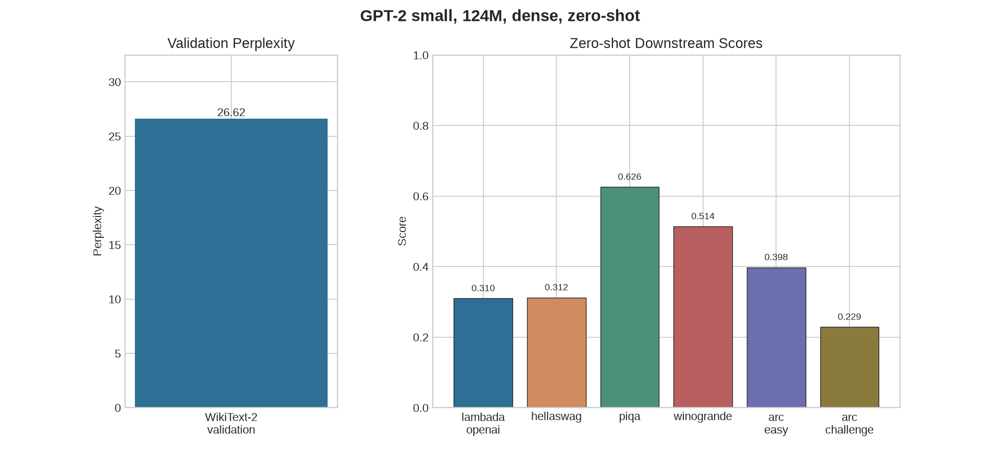
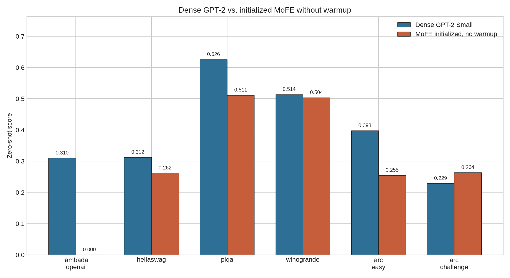
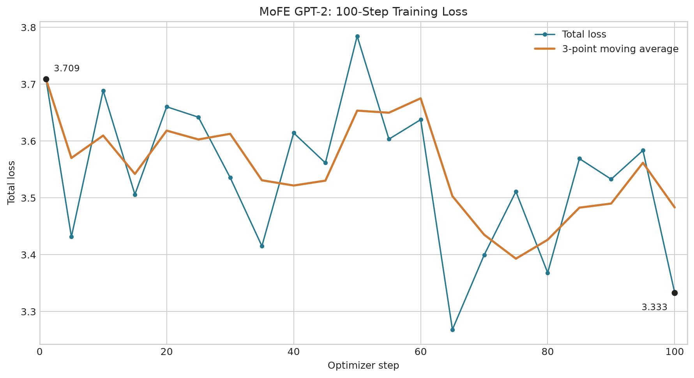

# MoFEbaseD2D

本仓库基于 [D2DMoE](https://github.com/bartwojcik/D2DMoE) 开展 GPT-2
实验，目前包含两部分工作：可复现的 GPT-2 Small dense 基线，以及在其最后
3 个 Transformer block 上构建的 MoFE（Mixture of Factorized Experts）方法。

当前公开仓库：<https://github.com/cpx196/MoFEbaseD2D>

## 时间线

### 2026-07-13

#### 建立 GPT-2 Small dense 基线

- 从上游 D2DMoE commit `a7027cdc` 开始整理实验环境。
- 创建 `d2d-gpt` Conda 环境，使用 Python 3.11、PyTorch 2.5.1+cu124。
- 加载 `openai-community/gpt2`，确认模型为 GPT-2 Small、12 层、
  `124,439,808` 参数。
- 在单张 RTX 4090 上完成固定 prompt 推理和 WikiText-2 validation
  perplexity 计算。
- 使用 `lm-evaluation-harness` 完成六项 zero-shot 下游评测。

Dense 基线结果：

| 任务 | 指标 | 分数 |
| --- | --- | ---: |
| WikiText-2 validation | perplexity | 26.6188 |
| LAMBADA OpenAI | accuracy | 0.3097 |
| HellaSwag | normalized accuracy | 0.3122 |
| PIQA | normalized accuracy | 0.6257 |
| WinoGrande | accuracy | 0.5138 |
| ARC Easy | normalized accuracy | 0.3977 |
| ARC Challenge | normalized accuracy | 0.2287 |

原始汇总保存在
[metrics_summary.csv](results/dense_gpt2_small/metrics_summary.csv)，结果图位于
`results/dense_gpt2_small/figures/`。



#### 整理为独立公开仓库

- 保留上游 MIT License、论文引用和 `upstream` Git remote。
- 增加缓存、数据集、权重、日志和密钥的忽略规则。
- 增加经过验证的 dense 评测依赖和三个基线评测/绘图脚本。
- 将 dense 汇总 CSV 和结果图纳入版本管理，不提交模型权重和数据集。
- 仓库整理提交：`50c8b67`。

#### 定义 MoFE 结构

根据 `D2Dinstr/MoFE_GPT2_MoFEversion.md` 确定主实验结构：

- 只替换 GPT-2 block 9、10、11 的 MLP。
- 每层保留一个始终激活的 dense shared expert。
- 每层增加 16 个 factorized private experts。
- 4 组 A 和 4 组 B 通过笛卡尔积组合，每个 private expert 使用独立 core。
- Router 对每个 token 从 16 个 private experts 中选择 top-3。
- Shared expert 不参与路由，也不由 router 权重缩放。

Private expert 的两个投影均按以下形式构建：

```text
W1_e = A1_i C1_e B1_j
W2_e = A2_i C2_e B2_j
e = 4i + j
```

GPT-2 hidden size 为 768，主配置 rank 为 576。A/B 使用 dense FFN 权重的
行列切片初始化，core 使用标准差 0.025 的独立随机初始化。

#### 完成 MoFE 代码与验证链路

- 在 `MoFE/` 中实现模型转换、factorized expert、token-choice top-3 路由、
  balance loss 和 router z-loss。
- Private expert 按 `x -> B -> core -> A` 执行，不为每个 token 物化完整权重。
- 增加 MoFE 配置、参数分类统计、checkpoint 保存/重载和初始化报告。
- 增加支持 Accelerate/DDP 的训练入口，初步训练预算为 200 optimizer steps。
- 训练数据集没有写死；启动时必须显式传入 `--dataset-name` 或
  `--train-file`。
- 增加跨 rank expert 负载、router entropy、tokens/s、峰值显存和
  private/shared 输出范数监控。
- MoFE 实现提交：`06ea609`。

真实 GPT-2 Small 构建结果：

| 项目 | 结果 |
| --- | ---: |
| 总参数量 | 209,595,696 |
| Shared expert 参数 | 14,167,296 |
| A/B factor bank 参数 | 53,084,160 |
| Core 参数 | 31,850,496 |
| Private bias 参数 | 184,320 |
| Router 参数 | 36,912 |

只启用 shared 分支时，MoFE 与原 dense GPT-2 的 logits 最大误差为 `0.0`。
随机 private 分支直接以完整强度启用时，一个短 prompt 上观测到的最大 logit
差为 `126.83`。该数值不是准确率，而是初始化扰动指标，因此训练入口默认让
private scale 在 200 steps 内从 0 线性增加到 1。

完成的验证包括：

- 5 项离线单元测试：shared 权重、A/B 切片、因子计算、top-3 路由与梯度、
  checkpoint 重载。
- 真实 GPT-2 Small 的三层 MoFE 构建和短序列前向。
- Tiny GPT-2 的 2-step 端到端训练、日志和 final checkpoint 重载。

#### 评测未 warmup 的初始化 MoFE

为了直接验证随机 private 分支全开造成的影响，构建 MoFE 后不执行训练，固定
`private_scale=1.0`，直接运行与 dense 基线相同的六项 zero-shot 任务。该实验
是 initialization-only 对照，不代表训练后的 MoFE。

| 任务 | Dense | MoFE no-warmup | 绝对变化 |
| --- | ---: | ---: | ---: |
| LAMBADA OpenAI | 0.3097 | 0.0000 | -0.3097 |
| HellaSwag | 0.3122 | 0.2619 | -0.0503 |
| PIQA | 0.6257 | 0.5114 | -0.1143 |
| WinoGrande | 0.5138 | 0.5036 | -0.0103 |
| ARC Easy | 0.3977 | 0.2546 | -0.1431 |
| ARC Challenge | 0.2287 | 0.2637 | +0.0350 |



除 ARC Challenge 外，其余五项均下降；更重要的是，MoFE 分数整体接近各
选择题任务的随机猜测水平，LAMBADA accuracy 降为 0。ARC Challenge 的
`0.2637` 也接近四选一随机水平，不能解释为能力提升。这与初始化时观测到的
巨大 logit 扰动一致，说明不能跳过 private 分支 warmup 或等效的稳定初始化。

比较数据保存在
[`no_warmup_vs_dense.csv`](results/mofe_gpt2_no_warmup/figures/no_warmup_vs_dense.csv)。
完整 `lm-eval` JSON 和日志保存在仓库外的数据目录
`/home/pxchen/data/pxchen/results/mofe_gpt2_no_warmup/`。

### 2026-07-14

#### 定位首次 WikiText-103 100-step 训练异常

- 选择 WikiText-103 train 作为 MoFE continued-training 数据，使用 GPT-2
  tokenizer 打包为 1024-token 序列。
- 首次 4 卡运行中，LM loss 从 `3.7386` 上升至 `12.5940`，未满足短程训练
  loss 下降的验收条件；该失败 checkpoint 已删除。
- 使用原始 dense GPT-2 在相同 packed 数据随机抽取 16 条序列，平均 loss 为
  `3.5247`，确认数据和 causal-LM preprocessing 不是 loss 爆炸的主因。
- 初始化 private/shared 输出范数比在 block 9、10、11 分别约为
  `13.2、14.2、29.0`。线性 private warmup 到 step 5 时，最后一层 private
  分支的实际强度已经超过 shared 分支。
- 同时发现 Accelerate 在 4 卡下将 scheduler 推进了 4 倍：optimizer 为
  100 steps，而 scheduler 到达 400。该问题导致 cosine LR 多次降至 0 后回升。

#### 修复四卡训练链路与实时监控

- 关闭 Accelerate 按进程数自动推进 scheduler，只在真实 optimizer update 后
  调用一次 `scheduler.step()`。复测 checkpoint 中 optimizer 和 scheduler 均为
  100 steps。
- 将每卡 batch size 从 1 提高到 4，同时将 gradient accumulation 从 8 降到
  2；四卡有效 batch 仍为 32 条序列，即每个 optimizer step 处理 32,768 tokens。
- 增加启动配置摘要、clipping 前 gradient norm、紧凑单行 step 日志和强制
  flush。完整 routing 统计继续保存为 JSONL。
- batch 4 运行峰值 PyTorch allocated memory 为 `10.59 GiB/卡`，最终吞吐为
  `63.1k tokens/s`；相较 batch 1 的约 `23.9k tokens/s` 提高约 2.6 倍。

#### 使用保持原函数的 private 初始化

原始实现同时随机初始化 `C1` 和 `C2`，导致未经训练的 private 分支产生巨大
输出。稳定版本保留 A/B dense 切片和随机输入 core，但将输出 core 初始化为零：

```text
C1_e ~ Normal(0, 0.025^2)
C2_e = 0
```

因此初始化时每个 private expert 输出严格为 0，完整 MoFE 与 dense GPT-2 的
logits 最大误差为 `0.0`。训练开始后 `C2` 先获得梯度；随着 `C2` 离开零点，
A/B 和 `C1` 逐步获得语言模型梯度。该变化只修改初始化，不改变 token-choice
top-3 路由和最终 MoFE 表达能力。

离线单元测试覆盖了 `C2` 零初始化、完整 MoFE/dense logits 对齐、`C2` 非零
梯度、factorized/materialized 前向一致性和 checkpoint 重载。真实 GPT-2 初始化
报告保存在
[initialization_report.json](results/mofe_gpt2_zero_core2_100step/initialization_report.json)。

#### 完成稳定的 100-step 工程训练

使用 4 张 RTX 4090、bf16、每卡 batch 4、gradient accumulation 2、LR
`1e-5`、10-step LR warmup 和 100-step private scale warmup 完成 WikiText-103
短程训练。

| 指标 | Step 1 | 最低记录值 | Step 100 |
| --- | ---: | ---: | ---: |
| LM loss | 3.6908 | 3.2503 | 3.3153 |
| Total loss | 3.7088 | 3.2684 | 3.3333 |
| Pre-clip gradient norm | 6.1875 | 3.0625 | 6.4375 |

Step 100 的 block 9、10、11 raw private/shared 输出范数比分别为
`0.96、0.47、0.61`，不再出现随机 private 分支压倒 shared 分支的情况。三个
输出 core 的 norm 分别增长到 `0.346、0.320、0.303`，确认 private 分支已从零
初始化中启动。这里的 loss 是工程训练日志中的采样 microbatch loss，不替代独立
validation loss。

[完整训练 JSONL](results/mofe_gpt2_zero_core2_100step/training_log.jsonl) 和
[作图脚本](MoFE/plot_training_loss.py) 均由训练输出直接生成结果图：



## 当前状态

已经完成 dense 基线、MoFE 架构代码、未训练 no-warmup 对照、WikiText-103
数据链路、稳定初始化和 4 卡 100-step 工程训练。零输出 core 版本在短程训练中
保持 loss 稳定并成功训练 private 分支，但尚未完成独立 validation perplexity、
六项 zero-shot 评测及相同 token 预算的 dense/upcycling MoE 对照，因此不能将
该工程结果解释为最终方法收益。

下一阶段顺序为：

1. 在 WikiText-2 validation 和六项 zero-shot 任务上评测 step-100 checkpoint。
2. 增加独立 validation loss，并据此选择 checkpoint，而不是使用训练 loss。
3. 以相同 token 数、数据顺序和有效 batch 运行 dense 与 dense upcycling MoE。
4. 根据验证结果决定是否扩大训练步数并补充 3 个随机种子。
5. 绘制 validation perplexity、expert usage、router entropy 和对照训练曲线。

## 主要文件

| 路径 | 作用 |
| --- | --- |
| `MoFE/layer.py` | Shared expert、factorized private experts 和路由前向 |
| `MoFE/modeling.py` | GPT-2 block 替换、损失、统计和参数量 |
| `MoFE/train.py` | 默认 200-step 的通用训练入口 |
| `MoFE/validate_initialization.py` | 真实 GPT-2 初始化报告 |
| `MoFE/eval_no_warmup.py` | 未训练、无 warmup MoFE 的 lm-eval 入口 |
| `MoFE/plot_no_warmup_comparison.py` | Dense/MoFE 对比 CSV 与柱状图 |
| `MoFE/plot_training_loss.py` | 从训练 JSONL 生成 loss 曲线 |
| `MoFE/tests/test_mofe.py` | 无数据集依赖的单元测试 |
| `MoFE/configs/` | MoFE 主实验配置 |
| `MoFE_METHOD.md` | MoFE 数学定义、初始化和训练细节 |
| `moe_block/` | 构建 MoFE 时参考的原始实现 |
| `D2Dinstr/` | Dense 基线和 MoFE 实验任务说明 |

运行离线测试：

```bash
python -m unittest MoFE.tests.test_mofe
```

本次 100-step 工程训练的核心参数：

```bash
accelerate launch --num_processes 4 -m MoFE.train \
  --train-file ./data/pxchen/datasets/wikitext103/train.jsonl \
  --text-column text \
  --per-device-batch-size 4 \
  --gradient-accumulation-steps 2 \
  --max-steps 100 \
  --learning-rate 1e-5 \
  --warmup-steps 10 \
  --private-warmup-steps 100
```
